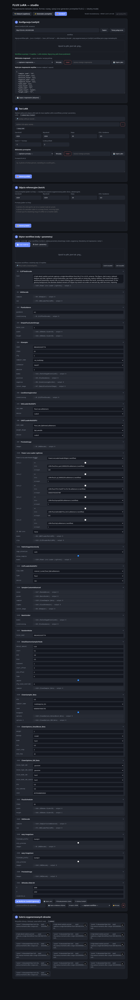

# FLUX LoRA — przygotowanie zdjęć do treningu

Narzędzie z interfejsem w przeglądarce, które przygotowuje dataset pod trening
LoRA (FLUX): ujednolica **rozmiary** (bucketing / kwadrat), **format** (PNG/JPG)
i **nazwy plików**, oraz generuje **szczegółowe opisy** zdjęć lokalnym modelem
wizualnym (Qwen2.5-VL) w jednym z trybów: **osoba**, **architektura**,
**krajobraz** lub **ogólny**.

W trybie *osoba* model opisuje wszystko o postaci: wiek, sylwetkę, twarz, włosy,
mimikę, każdy element ubioru, akcesoria, pozę, kadr, tło, oświetlenie i styl.

Aplikacja ma też zakładkę **✨ Generator promptów** — pomaga pisać prompty do
generowania obrazów w FLUX.2: *Rozbuduj* zamienia krótki pomysł w pełny, warstwowy
prompt, a *Popraw* porządkuje istniejący/tagowy prompt i dostosowuje go do FLUX.2
(naturalne zdania, struktura temat → scena → kadr → światło → styl, bez zaklęć w
stylu SD). Używa tego samego lokalnego modelu co opisy — w trybie tekstowym, bez obrazu.

W prawym górnym rogu widoczny jest status GPU (załadowany model i zużycie VRAM)
oraz przycisk **⏏ Zwolnij GPU**, który wyładowuje model z pamięci karty.

## Zrzuty ekranu

**📸 Dataset (captions)** — źródło zdjęć, ustawienia datasetu i generowanie opisów:


**✨ Generator promptów** — rozbudowa i poprawianie promptów pod FLUX.2:


**🎨 ComfyUI** — konfiguracja, test LoRA, batch referencyjny, edytor workflow i galeria:



## Wymagania

- Linux / WSL2 (testowane: WSL2 + RTX 4070 Ti, 12 GB VRAM)
- [`uv`](https://docs.astral.sh/uv/) (zarządza Pythonem i zależnościami)
- Karta NVIDIA z CUDA (działa też na CPU, ale opisywanie jest wtedy bardzo wolne)

## Uruchomienie

```bash
cd ~/flux-lora-prep
./run.sh
```

Następnie otwórz **http://127.0.0.1:8000**. Pierwsze użycie funkcji opisów pobierze
wagi modelu (kilka GB) z Hugging Face — kolejne uruchomienia są szybkie.

## Jak działa (krok po kroku w UI)

1. **Źródło** — podaj ścieżkę do folderu ze zdjęciami *albo* prześlij pliki.
2. **Ustawienia** — wybierz tryb, rozdzielczość (768/1024/1280/1536), krok
   bucketów, format, model VLM (3B szybki / 7B najlepszy), kwantyzację i
   opcjonalny *trigger word*.
3. **Przetwórz** — narzędzie zmienia rozmiar i (opcjonalnie) generuje opisy;
   widzisz postęp.
4. **Podgląd i edycja** — sprawdź miniatury i popraw opisy ręcznie.
5. **Eksport** — podaj folder docelowy. Powstaną pary `osoba_0000.png` +
   `osoba_0000.txt` gotowe do treningu (kohya_ss, ai-toolkit, SimpleTuner itp.).

## Format wyjściowy

```
dataset/
├── person_0000.png
├── person_0000.txt   # "ohwx person, <szczegółowy opis…>"
├── person_0001.png
├── person_0001.txt
└── …
```

## Wybór modelu i pamięć (RTX 4070 Ti, 12 GB)

| Model              | Tryb     | VRAM   | Uwagi                          |
|--------------------|----------|--------|--------------------------------|
| Qwen2.5-VL-3B      | fp16     | ~7 GB  | Szybki, dobry                  |
| Qwen2.5-VL-7B      | 4-bit    | ~9 GB  | Najlepsze, najszczegółowsze opisy (domyślny) |

## Styl podpisów (FLUX.2)

Podpisy są pisane jako pełne, naturalne zdania (FLUX.2 ma enkoder LLM), z naciskiem
na relacje przestrzenne i akcje, bez słów oceniających. W trybie **osoba** opisywane
jest tylko to, co zmienne (poza, ubranie, tło, ujęcie, światło, mimika), a stała
twarz/tożsamość jest pomijana — trigger word ma wchłonąć wygląd. Szczegóły i zasady:
zob. [`flux2_jak_tworzyc_podpisy.md`](flux2_jak_tworzyc_podpisy.md).

## Uwagi o bucketingu

Tryb „buckety" zachowuje proporcje: dobiera wymiary będące wielokrotnością
kroku (np. 64) tak, aby liczba pikseli była zbliżona do `rozdzielczość²`, a
następnie dopasowuje zdjęcie (cover + przycięcie do środka). Tryb „kwadrat"
przycina wszystko do `rozdzielczość × rozdzielczość`.
