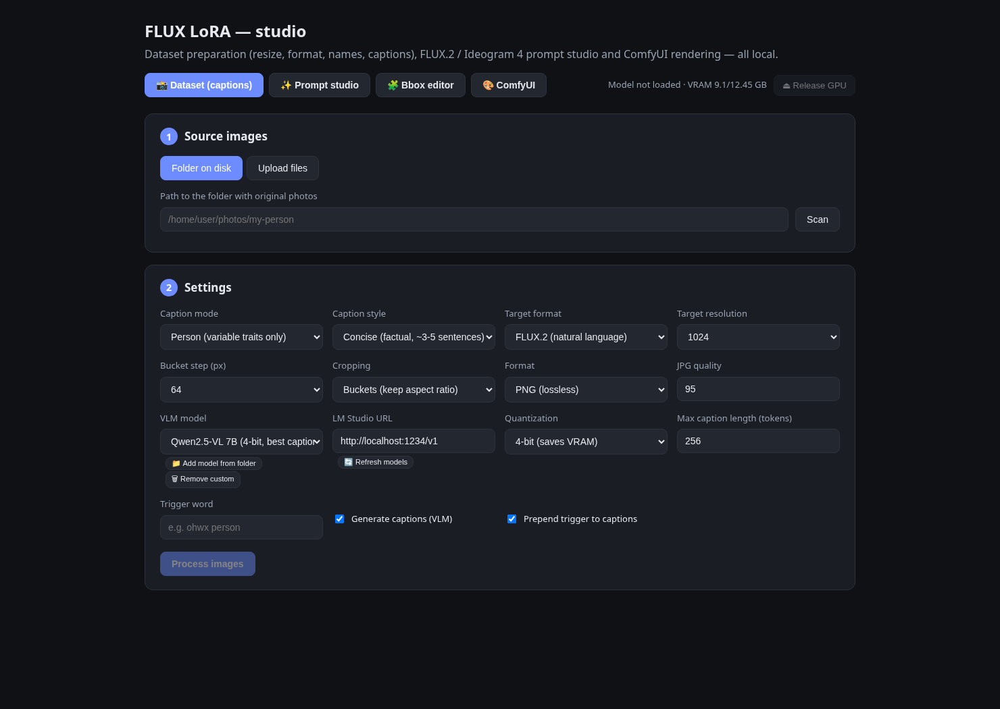
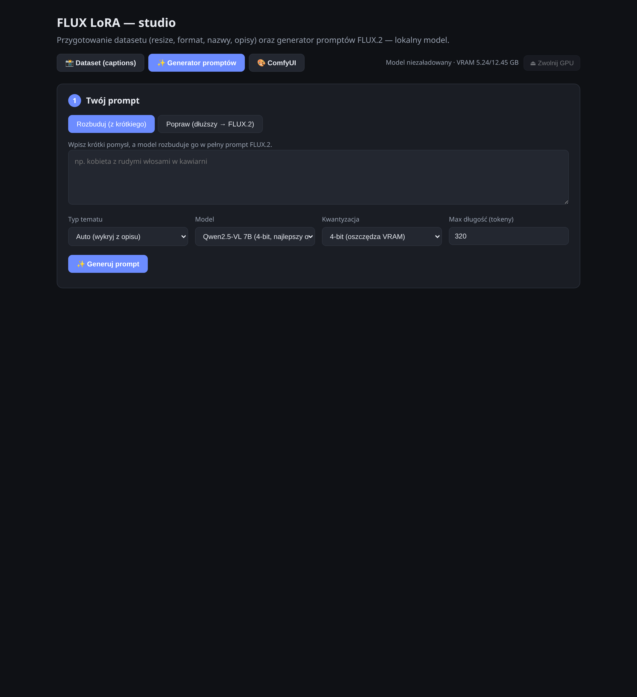
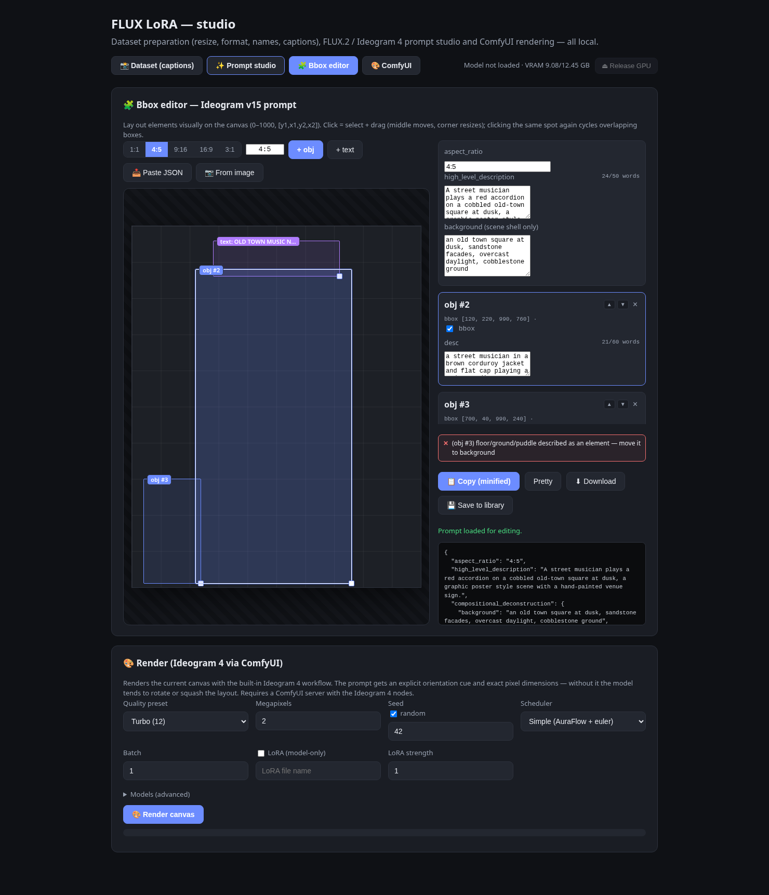
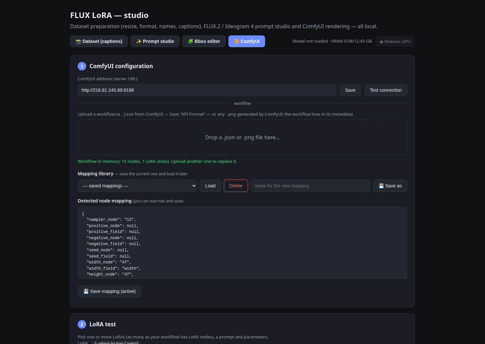

# Ideogram4 FLUX2 LoRA — dataset & prompt studio

A browser-based, fully local toolbox for FLUX LoRA training and Ideogram 4
prompting:

- **📸 Dataset (captions)** — prepares a LoRA training dataset: unifies
  **sizes** (bucketing / square crop), **format** (PNG/JPG) and **file names**,
  and captions the photos with a local vision model (Qwen2.5-VL) in one of the
  modes: **person**, **person — details**, **style** (content-only, for a style
  LoRA), **architecture**, **landscape** or **generic**. Captions can be plain
  FLUX.2 prose, Ideogram 4 JSON or ai-toolkit JSON; Ideogram captions use the
  v15 framework and carry per-element **bboxes**, exactly like the bbox editor.
- **✨ Prompt studio** — writes generation prompts for you. *Expand* turns a
  short idea into a full layered prompt; *Refine* cleans up an existing or
  tag-style prompt. Targets **FLUX.2** (natural prose) or **Ideogram 4 JSON**
  (the **v15 framework**: `aspect_ratio` + `high_level_description` +
  `compositional_deconstruction`, one-subject-one-element, background-as-shell,
  0–1000 bboxes). Ideogram output is structurally normalized in Python and
  checked by a built-in **v15 linter**; element-count / description-density
  controls and composition-preserving **style presets** (era / style / genre)
  steer the generation. Every prompt is auto-saved to a **SQLite prompt
  library** with one-click copy and `.sql` export.
- **🧩 Bbox editor** — a visual canvas for Ideogram v15 prompts: drag and
  resize element boxes on an aspect-ratio-true 0–1000 grid, edit obj/text
  cards with live word counters and a live v15 linter, import old/broken/
  double-encoded JSONs (they get unwrapped and converted), or start from a
  **reference photo** with a choice of three analysis engines: **Florence-2**
  (fast, measured bboxes + OCR), **VLM only** (Qwen2.5-VL or any LM Studio
  vision model drafts the whole JSON) or **Hybrid** (Florence's measured
  bboxes + the VLM's rich v15 prose). The current canvas renders directly on
  your ComfyUI server with a **built-in Ideogram 4 workflow** (quality
  presets, both scheduler variants, optional LoRA), with an explicit
  orientation cue that stops the model from rotating or squashing the layout.
- **🎨 ComfyUI** — generic ComfyUI integration: LoRA testing with any uploaded
  workflow, reference-image batches, a node/parameter workflow editor with a
  graph view and a SQLite workflow library, plus a persistent gallery.

The top bar shows the GPU status (loaded model and VRAM usage) and a
**⏏ Release GPU** button that unloads the models from the card.

## Screenshots

**📸 Dataset (captions)** — source images, dataset settings and captioning:



**✨ Prompt studio** — expanding/refining prompts for FLUX.2 and Ideogram 4
(v15), with the prompt library below:



**🧩 Bbox editor** — visual v15 canvas with the live linter and the built-in
Ideogram 4 render panel:



**🎨 ComfyUI** — configuration, LoRA test, reference batches, workflow editor
and gallery:



## Requirements

- Linux / WSL2 (tested: WSL2 + RTX 4070 Ti, 12 GB VRAM)
- [`uv`](https://docs.astral.sh/uv/) (manages Python and the dependencies)
- An NVIDIA GPU with CUDA (CPU works too, but captioning is very slow)
- For rendering: a ComfyUI server with the Ideogram 4 nodes
  (`Ideogram4Scheduler`, `DualModelGuider`, `CFGOverride`,
  `EmptyFlux2LatentImage`) and the Ideogram 4 / FLUX.2 model files

## Running

```bash
cd ~/flux-lora-prep
./run.sh
```

Then open **http://127.0.0.1:8123**. The first use of captioning downloads the
VLM weights (a few GB) from Hugging Face; the first use of **📷 From image**
downloads Florence-2 (~0.7 GB). Later runs are fast.

## How it works (step by step in the UI)

### Dataset

1. **Source** — point at a folder of photos *or* upload files (HEIC included).
2. **Settings** — pick the caption mode and target format, resolution
   (768/1024/1280/1536), bucket step, output format, the VLM model
   (3B fast / 7B best, or any model via LM Studio), quantization and an
   optional *trigger word*.
3. **Process** — the tool resizes and (optionally) captions; you watch the
   progress live.
4. **Review** — check the thumbnails and edit any caption by hand.
5. **Export** — to a folder or a `.zip`. You get `person_0000.png` +
   `person_0000.txt` pairs ready for kohya_ss, ai-toolkit, SimpleTuner etc.
   (Ideogram format additionally writes a pretty `person_0000.json`.)

### Prompt studio

Type an idea (or paste an existing prompt), pick the target format and click
**✨ Generate**. For Ideogram formats the result is a single minified v15 JSON,
normalized in Python (key order, aspect ratio, bbox sanity, legacy-schema
stripping) and linted — warnings show up right under the result. Every result
lands in the **prompt library** (SQLite): filter by category, copy a whole
prompt with one click, open it on the canvas, delete the rejects, or export
everything to a `.sql` file.

### Bbox editor

Lay out the scene visually: `+ obj` / `+ text` add elements, dragging moves,
the corner handle resizes, clicking the same spot again cycles overlapping
boxes, the ▲▼ arrows control the z-order (painter's algorithm). The side panel
holds the `aspect_ratio` / HLD / background fields and one card per element
with live word counters (50 for the HLD, 60 per desc) and the v15 linter.
Get a starting point three ways: **📥 Paste JSON** (any format — legacy
`style_description` schemas, `caption`/`data` wrappers and double-encoded
JSONs are unwrapped and converted), **📷 From image**, or **🧩 Edit on
canvas** from the studio result or any library entry. Then **💾 Save to
library**, copy/download the JSON, or **🎨 Render canvas** straight on
ComfyUI.

**From image** offers three analysis engines:

| Engine | Bboxes | Descriptions | Cost |
|--------|--------|--------------|------|
| **Florence-2** (default) | measured (object detection + OCR) | terse labels | ~1 GB VRAM, fast |
| **VLM only** | estimated by the vision model | full v15 prose | the chosen VLM |
| **Hybrid** | measured by Florence-2, kept verbatim | rewritten by the VLM to full v15 prose | both models |

The VLM is picked from the same list as the captioner/studio: local
Qwen2.5-VL (3B/7B), custom model folders, or any vision model served by
LM Studio. Hybrid gives the best drafts: real geometry and literal OCR text
with identity-first 30–60-word descriptions.

### Ideogram 4 rendering

The built-in workflow needs no .json upload: pick a quality preset
(Quality 48 / Default 20 / Turbo 12 steps), megapixels, seed, the scheduler
variant (the community *simple* AuraFlow+euler one, or the original
*Ideogram 4* scheduler), an optional model-only LoRA (autocompleted from your
ComfyUI), and press render — live progress, sampler preview and a result grid
included. The prompt text is prefixed with an explicit orientation statement
(`LANDSCAPE orientation: … 1776x1184 pixels … do not rotate or mirror the
layout`) plus the exact output dimensions computed with the same math the
workflow uses — without this cue the model tends to rotate the result ~90° or
squash the layout.

## Output format

```
dataset/
├── person_0000.png
├── person_0000.txt   # "ohwx person, <detailed caption…>"
├── person_0001.png
├── person_0001.txt
└── …
```

## Model choice and memory (RTX 4070 Ti, 12 GB)

| Model              | Mode     | VRAM   | Notes                                  |
|--------------------|----------|--------|----------------------------------------|
| Qwen2.5-VL-3B      | fp16     | ~7 GB  | Fast, good                             |
| Qwen2.5-VL-7B      | 4-bit    | ~9 GB  | Best, most detailed captions (default) |
| Florence-2-base-ft | fp16     | ~1 GB  | Image → v15 draft (bboxes + OCR)       |

Any OpenAI-compatible local server also works for text/caption generation via
**LM Studio** (set its URL in the dataset tab and pick a `lmstudio:` model).

## Caption modes

| Mode | Describes | Skips (so the trigger absorbs it) |
|------|-----------|-----------------------------------|
| **Person** | what varies between photos: pose, expression, clothing, framing, background, lighting | the fixed face/identity |
| **Person — details** | rich physical detail: age, build, marks (scars/moles/tattoos), hair, skin | — (full likeness, for non-trigger use) |
| **Style** | only the content & composition (subjects, objects, layout) | the art style, medium, palette and grading — for a **style LoRA** |
| **Architecture / Landscape / Generic** | subject, materials, setting, framing, light | — |

The same modes drive both the FLUX.2 prose captions and the Ideogram 4 JSON
captions.

## Caption style (FLUX.2)

Captions are written as full natural sentences (FLUX.2 has an LLM text
encoder), focused on spatial relationships and actions, with no judgemental
words. The **person** and **style** modes use the same residual trick: they
describe everything *except* the thing the trigger word should learn (the
person's likeness, or the art style), so that signal is attributed to the
trigger during training.

## Ideogram 4 dataset captions (v15 + bboxes)

When the target format is **Ideogram 4 JSON** (or ai-toolkit), dataset captions
use the same v15 framework as the prompt studio and the bbox editor, so every
element carries a measured `[y1,x1,y2,x2]` bbox on the 0–1000 grid. The VLM is
asked to estimate each element's position from the photo; the result is
structurally normalized in Python (key order, aspect ratio from the image,
bbox sanity) and the trigger word is injected into `high_level_description` at
export. Each image yields a minified `.txt` plus a pretty `.json`. Load any of
these straight into the **bbox editor** to fine-tune the boxes.

## Ideogram v15 in one paragraph

The studio and the editor target the v15 caption framework: exactly three
top-level keys (`aspect_ratio`, `high_level_description`,
`compositional_deconstruction` with `background` + `elements`), no
`style_description`/`color_palette` (style, light and medium are woven into
the prose), one subject = one element with parts inside its `desc`,
floor/sky/weather live only in `background`, bboxes are `[y1,x1,y2,x2]` on a
0–1000 grid normalized per axis, literal strings go into `text` elements
verbatim, and hedging ("various", "such as", "or") is banned. The built-in
linter (server-side and live in the editor) flags violations of these rules.

## Bucketing notes

The "buckets" mode keeps aspect ratios: it picks dimensions that are multiples
of the step (e.g. 64) with a pixel count close to `resolution²`, then fits the
photo (cover + center crop). The "square" mode crops everything to
`resolution × resolution`.

## Project layout

```
backend/
├── server.py             # FastAPI app: routes, jobs, SQLite, export
├── captioner.py          # local VLM (Qwen2.5-VL) loading + generation
├── lmstudio.py           # LM Studio (OpenAI-compatible) client
├── prompts.py            # caption/prompt instructions + v15 normalizer
├── v15_lint.py           # server-side v15 prompt linter
├── florence.py           # Florence-2: image -> v15 draft (bboxes + OCR)
├── ideogram_workflow.py  # built-in Ideogram 4 ComfyUI graph builder
├── comfy_client.py       # ComfyUI HTTP/WS client
├── comfy_workflows.py    # workflow parsing (.json / .png metadata)
└── image_utils.py        # resizing, bucketing, HEIC support
frontend/
├── index.html            # all views
├── app.js                # dataset, studio, library, ComfyUI views
├── studio_extras.js      # detail controls, style presets, lint rendering
├── bbox_editor.js/.css   # the visual v15 canvas editor
├── ideogram_render.js    # render panel for the built-in workflow
└── image_to_prompt.js    # reference-image analysis (Florence-2)
```
